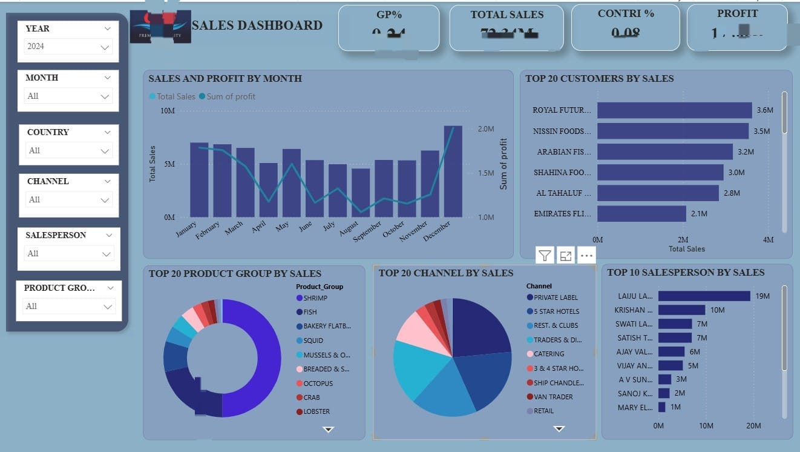

# Sales_Analysis
sales analytics using SQL and Power BI.

## Project Overview

This project focuses on analyzing sales performance using SQL and Power BI.
The objective is to understand revenue, profit, quantity sold, customer
performance, salesperson performance, product performance, and sales trends.

The analysis was performed using SQL, and the results were visualized through
an interactive Power BI dashboard.

---

## Tools & Technologies

- SQL
- Power BI
- DAX

---

## Dataset

The analysis uses sales transaction data containing information related to:

- Sales transactions
- Products
- Customers
- Salespersons
- Product groups
- Sales types / channels
- States
- Transaction dates
- Revenue
- Quantity
- Profit

---

## Business Questions

The project answers the following business questions:

### Sales Performance
- What is the total revenue?
- What is the total profit?
- What is the total quantity sold?
- What is the overall profit margin?
- How does revenue change over time?

### Product Analysis
- Which products generate the highest revenue?
- Which product groups perform best?
- Which products have the highest quantity sold?

### Customer Analysis
- Which customers generate the highest revenue?
- What is the contribution of different customers to total sales?

### Salesperson Analysis
- Which salespersons generate the highest revenue?
- How does profit vary across salespersons?

### Channel Analysis
- Which sales channels generate the most revenue?
- How does profit vary across sales channels?

### Geographic Analysis
- Which states generate the highest revenue?
- How does profitability vary by state?

---

## SQL Analysis

SQL was used to perform:

- KPI calculations
- Revenue and profit analysis
- Time-based analysis
- Product analysis
- Customer analysis
- Salesperson analysis
- Channel analysis
- Geographic analysis
- Ranking analysis
- Month-over-month growth analysis
- Cumulative revenue analysis

Advanced SQL techniques used include:

- LAG()
- RANK()
- ROW_NUMBER()
- CASE WHEN
- Aggregate functions
- JOINs

See `sales_dashboard_analysis.sql` for the complete SQL analysis.

---

## Power BI Dashboard

The Power BI dashboard provides an interactive view of sales performance,
including revenue, profit, quantity, product performance, customer analysis,
salesperson performance, channel analysis, and geographic performance.

### Dashboard Preview

---

## Key Insights

- Revenue and profit trends were analyzed across different time periods.
- Product and product-group performance were compared using revenue,
  quantity, and profit.
- Customer and salesperson performance were analyzed to identify major
  contributors to sales.
- Sales channels and geographic regions were compared based on revenue
  and profitability.

---

## Project Files

| File | Description |
|---|---|
| `sales_dashboard_analysis.sql` | SQL queries used for the analysis |
| `sales_dashboard.jpeg` | Power BI dashboard screenshot |
| `README.md` | Project documentation |

---

## Skills Demonstrated

- SQL querying
- Data aggregation
- Data analysis
- Business KPI analysis
- Window functions
- Power BI
- DAX
- Data visualization
- Business intelligence
